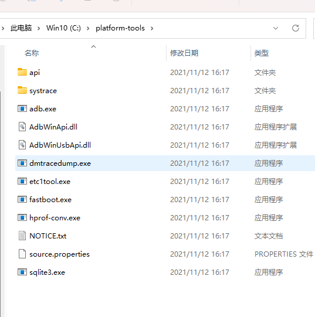
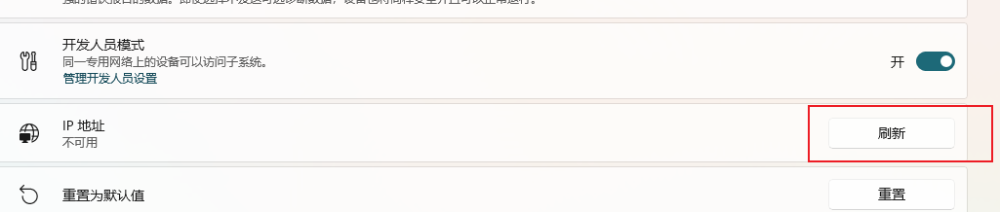

Win11 现在可以支持安装 Andriod 应用了，它可以像 PC 端本地一样去启动、卸载的管理方式。

在性能方面上，据网友们的跑分与实测，基本比目前任何的的安卓模拟器运行都要快。

下来跟着我看看如何安装。

## 系统准备

开始前需要启用两个东西，Hyper-V （需要 Windows 专业版才能安装） 和 “虚拟机平台”， 如下图：


## 安装 WSA

这是 Win11 上的安卓子系统，全称 **Windows Subsystem for Android。**

**安装包**：

链接：[https://pan.baidu.com/s/12OfaaPsA0yaiZvlURv-W1A](https://pan.baidu.com/s/12OfaaPsA0yaiZvlURv-W1A)
提取码：q1cs

下载好后进行解压，如下图：


复制第二个文件的路径，即：最长文件命名。


下来使用管理员权限打开 Powershell 窗口，运行如下命令：


Add-AppPackage 之后的路径就是刚才复制的，直接在终端粘贴即可。

如果没有问题就会出现如下进度条，等待完成即可。如果你输入上面的命令后提示“部署失败”、“为此程序包依赖于一个找不到的框架”等错误的话，是由于系统缺少一些运行库组件。你需要先手动安装压缩包里的所有依赖包。


安装完成之后，会在开始界面出现安装的子系统。


下来 Andriod 子系统安装好了，下来就要看如何安装应用。

### 安装 adb

安装 apk 应用需要这个 adb 工具，安装包如下：

链接：[https://pan.baidu.com/s/1TLMKezPHeMcc-acWSCpopA](https://pan.baidu.com/s/1TLMKezPHeMcc-acWSCpopA)
提取码：h2qc

下载后进行解压，如下图：



解压后，将解压后的目录路径添加到环境变量下。根据自己的本地的路径设置，图中的只是我自己的。


如果环境变量添加后没有问题，就可以在终端运行 adb 命令，如下图：


## 开始安装 apk

### 1. 先配置点环境

再次打开安卓子系统，如下图：


下来需要打开 “开发人员模式”，再点击 “管理开发人员设置”，会出现如下图中新的窗口，这个在暂时不要关闭。


下来再点击 “开发人员模式” 下的 “IP 地址” 后的刷新，点击后会出现 "127.0.0.1:58526" 地址。




### 2. 开始安装

继续打开终端，开始使用 adb 工具进行安装 apk。

```powershell
adb connect 127.0.0.1:58526
```

成功如下图：


紧接着就找一个你要安装的 apk 文件，我这里使用微信，运行如下命令：

```powershell
adb install "C:\Users\owner\Downloads\weixin8016android2040_arm64.apk"
```

成功如下图，这里要耐心等一小会：


完成后，现在看看安装的微信。打开开始界面，如下图：


如果你不想每次这么麻烦，那就可以安装一个应用商店，按照上述同样的步骤 connect > install 安装。安装好后，就直接打开应用商店安装其它应用即可。

应用商店前往下载：[https://coolapk.com/](https://coolapk.com/)

这方面就说到这了，如果有啥问题就在下方留言。